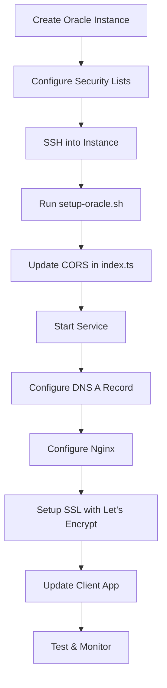

# 🚀 Oracle Cloud Migration Guide - Complete Package

## What's Included

I've prepared everything you need to migrate your WebSocket server from AWS EC2 to Oracle Cloud Infrastructure. Here's what was created:

### 📄 Documentation Files

1. **DEPLOYMENT_GUIDE.md** - Complete step-by-step deployment guide
   - Oracle Cloud instance setup
   - Security configuration
   - Server installation
   - SSL setup
   - Troubleshooting

2. **QUICK_REFERENCE.md** - Essential commands for daily operations
   - Quick deploy commands
   - Troubleshooting quick fixes
   - Monitoring commands

3. **DEPLOYMENT_CHECKLIST.md** - Interactive checklist to track your progress
   - Pre-deployment tasks
   - Step-by-step verification
   - Testing procedures

4. **README.md** - Server documentation
   - Features overview
   - Architecture
   - API events

### ⚙️ Configuration Files

5. **ecosystem.config.js** - PM2 process manager configuration
   - Auto-restart on crash
   - Log management
   - Memory limits

6. **chesseract-websocket.service** - systemd service configuration
   - Auto-start on boot
   - Automatic restart on failure
   - System-level process management

7. **nginx-config.conf** - Nginx reverse proxy configuration
   - WebSocket support
   - SSL/HTTPS ready
   - Long-lived connections

8. **.env.production** - Production environment variables template

### 🔧 Helper Scripts

9. **setup-oracle.sh** - Automated server setup script
   - Installs Node.js, nginx, PM2
   - Configures firewall
   - Installs dependencies

10. **update-cors.sh** - Interactive script to update CORS origins
    - Safely updates production domains
    - Creates backups
    - Validates changes

## 🎯 Quick Start - 3 Steps to Deploy

### Step 1: Create Oracle Cloud Instance
```bash
1. Go to Oracle Cloud Console
2. Create Ubuntu 22.04 Compute Instance
3. Configure Security Lists (ports 22, 80, 443, 3001)
4. Note your public IP address
```

### Step 2: Deploy the Server
```bash
# From your local machine, copy the server folder to Oracle instance
scp -r ../server ubuntu@YOUR_ORACLE_IP:~/

# SSH into your instance
ssh ubuntu@YOUR_ORACLE_IP

# Navigate to the server folder
cd ~/server

# Run automated setup
chmod +x setup-oracle.sh
./setup-oracle.sh

# Update CORS origins
nano index.ts  # Add your production domains

# Start the service
sudo cp chesseract-websocket.service /etc/systemd/system/
sudo systemctl enable --now chesseract-websocket
```

### Step 3: Configure Domain & SSL
```bash
# Point your subdomain to Oracle instance IP
# In your DNS provider (e.g., Cloudflare, Namecheap):
# Add A record: socket.chesseractindia.com → YOUR_ORACLE_IP

# Configure nginx as reverse proxy
sudo cp nginx-config.conf /etc/nginx/sites-available/chesseract-websocket
sudo ln -s /etc/nginx/sites-available/chesseract-websocket /etc/nginx/sites-enabled/
sudo nginx -t
sudo systemctl reload nginx

# Setup SSL with Let's Encrypt
sudo certbot --nginx -d socket.chesseractindia.com
```

### Step 4: Update Your Client
```bash
# In your Next.js app's environment variables
NEXT_PUBLIC_SOCKET_URL=https://socket.chesseractindia.com

# Redeploy your Next.js app
```

## 📚 Which Document to Use When

| Scenario | Document to Read |
|----------|-----------------|
| **First time deploying** | Start with DEPLOYMENT_GUIDE.md |
| **Need quick commands** | Use QUICK_REFERENCE.md |
| **Track deployment progress** | Use DEPLOYMENT_CHECKLIST.md |
| **Daily operations** | Use QUICK_REFERENCE.md |
| **Something broke** | Check DEPLOYMENT_GUIDE.md → Troubleshooting |
| **Understanding the server** | Read README.md |

## 🔄 Migration from AWS EC2

### What Changed
Your AWS EC2 setup likely had:
1. ✅ Node.js server running on port 3001
2. ✅ systemd service or PM2 for process management
3. ✅ Security groups allowing WebSocket traffic
4. ✅ nginx as reverse proxy
5. ✅ SSL certificate with Let's Encrypt

### Oracle Cloud Equivalents
| AWS EC2 | Oracle Cloud |
|---------|--------------|
| Security Groups | Security Lists (in VCN) |
| EC2 Instance | Compute Instance |
| Amazon Linux/Ubuntu | Ubuntu 22.04 |
| Route 53 (DNS) | Oracle DNS or external DNS |
| Elastic IP | Reserved Public IP (if needed) |

### Key Differences
1. **Firewall**: Oracle has TWO firewalls:
   - Security Lists (in Oracle Cloud Console)
   - iptables (on the instance itself)
   - Both must be configured!

2. **Always Free Tier**: Oracle offers 2 free AMD VMs forever (better than AWS Free Tier)

3. **Network**: Uses Virtual Cloud Networks (VCN) instead of VPC

## 🛠️ The Deployment Process



## ⚡ What Was Updated in Your Server Code

The server code (`index.ts`) you have is already production-ready! It includes:

✅ Connection handling
✅ Reconnection with grace period
✅ Timer management
✅ Game state synchronization
✅ Error handling

**You only need to update:**
```typescript
// In server/index.ts, line 7-8
origin: [
  "http://localhost:3000",                    // For local development
  "https://chesseractindia.com",              // ← Add your production domain
  "https://www.chesseractindia.com",          // ← Add www version
  "https://your-app.vercel.app"               // ← Add Vercel deployment URL if applicable
]
```

## 💡 Pro Tips

1. **Use systemd** (not PM2) for simpler management in production
2. **Always use HTTPS/WSS in production** - it's required for secure WebSocket connections
3. **Monitor logs regularly** with `sudo journalctl -u chesseract-websocket -f`
4. **Keep system updated** with weekly `sudo apt update && sudo apt upgrade`
5. **Test reconnection** thoroughly - it's your most important feature
6. **Use subdomains** (socket.chesseractindia.com) to separate concerns and simplify SSL management

## 🆘 Getting Help

### If WebSocket Won't Connect
1. Check Oracle Security Lists in console
2. Check iptables: `sudo iptables -L -n`
3. Check if server is running: `sudo systemctl status chesseract-websocket`
4. Check logs: `sudo journalctl -u chesseract-websocket -f`
5. Verify CORS origins in index.ts

### If Server Won't Start
1. Check logs: `sudo journalctl -u chesseract-websocket -n 50`
2. Check if port is in use: `sudo netstat -tulpn | grep 3001`
3. Verify Node.js is installed: `node --version`
4. Check service file: `sudo systemctl cat chesseract-websocket`

## 📊 Cost Comparison

| Service | AWS EC2 | Oracle Cloud |
|---------|---------|--------------|
| **Always Free** | 12 months only | Forever |
| **Instance Type** | t2.micro (1 vCPU, 1GB RAM) | VM.Standard.E2.1.Micro (1 vCPU, 1GB RAM) |
| **After Free Tier** | ~$8-10/month | $0 (stays free) |
| **Bandwidth** | 15GB/month free | 10TB/month free |

**Recommendation**: Oracle Cloud's Always Free tier is perfect for your WebSocket server!

## 🎉 Success Checklist

- [ ] Oracle instance created and running
- [ ] Security Lists configured (4 ports open: 22, 80, 443, 3001)
- [ ] Server code deployed via scp
- [ ] DNS A record pointing socket.chesseractindia.com to Oracle IP
- [ ] nginx configured as reverse proxy
- [ ] SSL certificate installed with Let's Encrypt
- [ ] CORS origins updated with production domains
- [ ] Service running: `sudo systemctl status chesseract-websocket`
- [ ] HTTPS works: visit `https://socket.chesseractindia.com` in browser
- [ ] Client app updated with NEXT_PUBLIC_SOCKET_URL=https://socket.chesseractindia.com
- [ ] Can start a game successfully
- [ ] Reconnection works
- [ ] Timers counting down correctly

## 📞 Next Steps After Deployment

1. **Set up monitoring**: Use PM2 monitoring or external service like UptimeRobot
2. **Configure alerts**: Get notified if server goes down
3. **Set up backups**: Regular backups of your configuration
4. **Document everything**: Keep notes on any custom changes
5. **Plan for scaling**: If traffic grows, consider load balancing

## 🔐 Security Best Practices

- ✅ Use SSH keys (no password auth)
- ✅ Keep system updated
- ✅ Use SSL/HTTPS in production
- ✅ Limit SSH access (consider changing default port)
- ✅ Regular security audits
- ✅ Monitor logs for suspicious activity
- ✅ Use firewall (both Security Lists and iptables)
- ✅ Implement rate limiting (future enhancement)

## 📈 Performance Optimization (Future)

Once deployed and stable, consider:
1. **Redis** for session storage (for horizontal scaling)
2. **Load balancer** if traffic increases
3. **CDN** for static assets
4. **Database** for persistent game history
5. **Analytics** for monitoring game metrics

## 🎓 Learning Resources

- [Oracle Cloud Free Tier](https://www.oracle.com/cloud/free/)
- [Socket.io Documentation](https://socket.io/docs/v4/)
- [nginx WebSocket Proxying](https://nginx.org/en/docs/http/websocket.html)
- [systemd Service Management](https://www.freedesktop.org/software/systemd/man/systemd.service.html)

---

## 🚀 Ready to Deploy?

1. Open **DEPLOYMENT_CHECKLIST.md** to track your progress
2. Follow **DEPLOYMENT_GUIDE.md** for detailed instructions
3. Keep **QUICK_REFERENCE.md** handy for commands

**Estimated Deployment Time**: 30-45 minutes for first-time setup

Good luck with your deployment! 🎯
